# KroomPrint — Master Feature & Architecture Plan (`plan.md`)

> Dokumen perencanaan teknis, analisis kesenjangan fitur (*gap analysis*), dan peta jalan pengembangan (*roadmap*) untuk mendukung penuh seluruh kapabilitas printer fisik (Epson, HP, Canon, Brother, Thermal Label, serta printer nirkabel IPP Everywhere / AirPrint).

---

## 1. Executive Summary & Visi Pengembangan

KroomPrint dirancang sebagai platform manajemen pencetakan modern (*Modern Web-to-Print Engine*) yang menjembatani browser pengguna dengan hardware pencetak fisik via CUPS, IPP, dan driver native hardware. 

Agar KroomPrint dapat beroperasi dengan kapabilitas penuh setara software OEM (seperti *Epson Print Layout*, *HP Smart*, atau *Canon Easy-PhotoPrint*), sistem membutuhkan 6 pilar fungsional utama:
1. **Hardware Health, Monitoring, & Maintenance** (Nozzle check, head cleaning, ink levels, sensor status).
2. **Advanced Document Layout & Imposition** (N-Up, manual duplex, booklet, borderless, collate, paper tray).
3. **Multi-Vendor Driver & Protocol Ecosystem** (PPD dynamic introspection, IPP Everywhere / AirPrint, HPLIP, brlaser).
4. **Queue Architecture, Concurrency, & Real-Time Sync** (WebSocket events, USB port mutex/worker pool, smart error recovery).
5. **Security, Quota Accounting, & Multi-Tenant SaaS** (Secure PIN release, page quotas, temporary spool encryption/purge).
6. **Mobile & Cross-Platform Flexibility** (Camera scan-to-print, responsive pinch-to-zoom).

---

## 2. Peta Analisis Kesenjangan Fitur (Gap Analysis)

### 2.1 Domain 1: Hardware Health, Monitoring, & Maintenance

| Fitur | Status Saat Ini | Rencana Implementasi Penuh | Relevansi Hardware |
|---|---|---|---|
| **Head Cleaning (Pembersihan Printhead)** | ❌ Belum ada di UI | Endpoint `POST /api/printers/:id/maintenance/clean-head`. Mengirim instruksi ESC/P-R cleaning sequence via CLI / IPP maintenance operation. | **Epson EcoTank** (L3210, L3250), **Canon PIXMA**, **HP Ink Tank**. |
| **Nozzle Check Pattern** | ❌ Belum ada di UI | Endpoint `POST /api/printers/:id/maintenance/nozzle-check`. Mencetak kisi-kisi pola garis nozzle untuk verifikasi saluran tinta tersumbat. | **Epson**, **Canon**, **HP**. |
| **Indikator Level Tinta Real-Time** | ⚠️ Simulasi statis | Query data sensor fisik via IPP `marker-levels` & `marker-colors`, SNMP Printer-MIB (RFC 3805), atau `escputil` / `hp-levels`. Menampilkan visual bar CMYK. | Semua printer USB & Network. |
| **Sensor Kerusakan & Peringatan Hardware** | ⚠️ Status generik (`online`/`error`) | Parsing IPP `printer-state-reasons` / CUPS state untuk mendeteksi: *Paper Jam*, *Cover Open*, *Out of Paper*, *Waste Ink Pad Counter Full*. | Semua brand printer. |
| **Printhead Alignment (Kalibrasi Garis)** | ❌ Belum ada | Mencetak lembar uji perataan head untuk mengoreksi cetakan miring/berbayang. | Epson, HP, Canon. |

---

### 2.2 Domain 2: Pengaturan Layout Dokumen Lanjutan (Advanced Print Settings)

| Fitur | Status Saat Ini | Rencana Implementasi Penuh |
|---|---|---|
| **N-Up (Multi-Page per Sheet)** | ❌ 1 halaman per sheet | Opsi cetak 2, 4, 6, 9, 16 halaman per lembar fisik via filter `pdfnup` / Ghostscript imposition / flag CUPS `number-up=2,4`. |
| **Manual Duplex Assistant (Ganjil-Genap)** | ⚠️ Terbatas hardware duplex | Untuk printer tanpa motor duplex (seperti **Epson L3210**): Sistem mencetak semua halaman ganjil $\rightarrow$ Menampilkan modal animasi instruksi balik kertas $\rightarrow$ Mencetak halaman genap urutan terbalik. |
| **Cetak Buku / Booklet (Saddle-Stitch)** | ❌ Belum ada | Imposisi halaman otomatis (misal: halaman 4-1 dan 2-3 pada selembar A4) sehingga saat dilipat di tengah membentuk buku A5. |
| **Collate (Urutan Rangkap)** | ⚠️ Default collated | Opsi switch: `Collate` (1,2,3 $\rightarrow$ 1,2,3) vs `Uncollated` (1,1 $\rightarrow$ 2,2 $\rightarrow$ 3,3) via flag `-o Collate=True/False`. |
| **Borderless Printing (Cetak Foto Penuh)** | ❌ Margin standar | Mengirim flag PPD `PageSize=A4.Borderless` / `4x6.Borderless` untuk cetak foto tanpa tepi putih. |
| **Pemilihan Jenis Kertas Fisik (Media Type)** | ⚠️ Terbatas Plain | Dropdown dinamis: *Plain Paper, Glossy Photo, Matte, Karton Tebal, Amplop (C6/DL), Stiker Label*. |
| **Pemilihan Baki Kertas (Input Tray)** | ❌ Default tray | Memilih sumber baki kertas: *Main Tray, Rear Slot, Manual Feed, Photo Tray*. |
| **Watermark & Security Stamp** | ❌ Belum ada | Menambahkan stempel teks transparan (*"DRAFT"*, *"CONFIDENTIAL"*, *"LUNAS"*, atau *Timestamp/User ID*). |

---

### 2.3 Domain 3: Ekosistem Driver Multi-Vendor & Protokol

| Area | Status Saat Ini | Rencana Implementasi Penuh |
|---|---|---|
| **Driverless IPP Everywhere / AirPrint** | ⚠️ Mengandalkan PPD statis | Dukungan pencetakan berbasis standard IPP Everywhere (`image/urf`, PWG-Raster) untuk semua printer nirkabel modern tanpa perlu instalasi PPD manual. |
| **Dukungan Vendor Spesifik** | • Epson: ESC/P-R | • **HP**: Integrasi modul HPLIP / PCL3 / PCL6. • **Brother**: Integrasi driver `brlaser` / LPR. • **Canon**: Integrasi UFR II / CAPT. • **Thermal Printer**: Integrasi ESC/POS, TSPL, ZPL untuk resi/label pengiriman (100x150mm). |
| **Dynamic PPD Introspection** | ⚠️ Flag di-hardcode | Mem-parsing file `/etc/cups/ppd/<printer>.ppd` secara dinamis agar seluruh kapabilitas unik printer (resolusi tinggi 5760 DPI, mode hemat tinta, dsb.) otomatis muncul di UI. |

---

### 2.4 Domain 4: Arsitektur Antrean, Concurrency, & Real-Time Sync

| Fitur | Status Saat Ini | Rencana Implementasi Penuh |
|---|---|---|
| **WebSocket / SSE Live Streaming** | ⚠️ HTTP Polling (800ms / 2.5s) | Koneksi WebSocket / SSE untuk *zero-latency state updates* bagi seluruh klien web saat status job berubah. |
| **USB Mutex & Concurrency Lock** | ⚠️ Goroutine bebas | Worker pool per antrean printer USB untuk mencegah tabrakan akses port biner (`device busy / status 1`). |
| **Scheduled & Delayed Printing** | ❌ Langsung diproses | Kemampuan menahan antrean dan mencetak otomatis pada jadwal yang ditentukan. |
| **Smart Error Recovery & Resume** | ❌ Gagal mengulang dari awal | Jika printer kehabisan kertas di halaman 15/50, cetak dapat dilanjutkan dari halaman 15. |

---

### 2.5 Domain 5: Keamanan, Kuota & Multi-Tenant SaaS (Enterprise)

| Fitur | Status Saat Ini | Rencana Implementasi Penuh |
|---|---|---|
| **Secure Print Release (PIN / QR Code)** | ❌ Auto-release ke printer | Dokumen ditahan di server sampai pengguna memasukkan 4-digit PIN atau scan QR code di lokasi fisik printer. |
| **Accounting & Kuota Halaman** | ❌ Tanpa limit | Pencatatan kuota cetak per departemen/user, perhitungan rasio biaya warna vs hitam-putih. |
| **Encrypted Spool & Auto-Purge** | ⚠️ File tersimpan di `uploads/` | Auto-wipe dan enkripsi berkas sementara setelah proses cetak selesai (kepatuhan privasi data & GDPR). |
| **Audit Log & Laporan Rekap** | ⚠️ History sederhana di SQLite | Ekspor riwayat penggunaan kertas, tinta, dan pengguna dalam format CSV / PDF. |

---

## 3. Diagram Arsitektur Target Sistem

```mermaid
graph TB
    subgraph ClientLayer["Frontend Client (React 19 + Vite)"]
        UI_Print["Print Studio & Preview (Canvas Cache)"]
        UI_Queue["Live Queue Monitor (WebSocket / SSE)"]
        UI_Maint["Maintenance Center (Nozzle / Clean)"]
        UI_Mobile["Mobile Scanner (Camera Scan-to-Print)"]
    end

    subgraph APILayer["Backend Server (Go + Chi/Std Mux)"]
        API_Gateway["API Gateway & Session Auth"]
        WS_Hub["WebSocket Event Hub"]
        PPD_Engine["Dynamic PPD Introspection Engine"]
        Doc_Converter["Converter Pipeline (LibreOffice + ImageMagick Cache)"]
        Job_Scheduler["Job Worker Pool & USB Mutex"]
    end

    subgraph ServiceLayer["Hardware Communication Layer"]
        CUPS_Spooler["CUPS Spooler (Local / SSH / IPP)"]
        SNMP_Monitor["SNMP / IPP Marker Level Poller"]
        Driver_ESCPR["Epson ESC/P-R Filter"]
        Driver_HPLIP["HP HPLIP / PCL Filter"]
        Driver_BRLASER["Brother brlaser Filter"]
        Driver_IPP["Driverless AirPrint (PWG-Raster)"]
    end

    subgraph PhysicalDevices["Physical Hardware"]
        Printer_Epson["Epson L3210 / L3250 (USB/WiFi)"]
        Printer_HP["HP Smart Tank / LaserJet (Network)"]
        Printer_Canon["Canon PIXMA / ImageRUNNER"]
        Printer_Brother["Brother Laser / HL Series"]
        Printer_Thermal["Thermal Shipping Label (ZPL/TSPL)"]
    end

    ClientLayer --> APILayer
    APILayer --> ServiceLayer
    ServiceLayer --> PhysicalDevices
```

---

## 4. Tahapan Peta Jalan Implementasi (Phased Roadmap)

### 🚀 Phase 1: Hardware Maintenance & Visual Ink Level (Sprint 1) — ✅ COMPLETED
- [x] Endpoint & UI untuk **Head Cleaning** (`/api/printers/:id/maintenance/clean-head`).
- [x] Endpoint & UI untuk **Nozzle Check Pattern Print** (`/api/printers/:id/maintenance/nozzle-check`).
- [x] Modul pembaca level tinta fisik (CMYK) via live cartridge meters di backend & frontend.
- [x] Deteksi sensor perangkat: *Paper Jam*, *Cover Open*, *Out of Paper*, *Low Ink*.
- [x] Pusat Diagnostik Interaktif (**Maintenance & Health Center Modal** di UI).

### 📄 Phase 2: Pengaturan Dokumen Lanjutan & Manual Duplex (Sprint 2)
- [ ] Implementasi **N-Up Imposition** (2, 4, 6, 9 halaman per lembar fisik).
- [ ] Fitur **Manual Duplex Assistant** dengan panduan visual ganjil $\rightarrow$ balik kertas $\rightarrow$ genap.
- [ ] Opsi **Collate** (1-2-3 vs 1-1-2-2-3-3).
- [ ] Opsi **Borderless Photo Printing** (A4 & 4x6).
- [ ] Dropdown dinamis jenis media kertas (*Glossy, Matte, Envelope, Label*).

### ⚡ Phase 3: Real-Time WebSocket & Robust Queue Concurrency (Sprint 3)
- [ ] Implementasi **WebSocket Hub** di backend Go untuk broadcast status job instan.
- [ ] Worker pool per device dengan **USB Port Mutex Lock** untuk mencegah error `device busy`.
- [ ] Fitur **Smart Resume** jika kertas habis di tengah dokumen tebal.

### 🔒 Phase 4: Enterprise Security, Kuota & Driverless IPP (Sprint 4)
- [ ] **Secure PIN Release / QR Code Release** sebelum dokumen keluar dari printer.
- [ ] Pencatatan kuota halaman & akuntansi biaya cetak per pengguna.
- [ ] Integrasi **Driverless IPP Everywhere & AirPrint** untuk printer nirkabel modern.
- [ ] Auto-purge dan enkripsi penyimpanan spool sementara.

---

*Dokumen ini merupakan acuan otoritatif pengembangan fitur KroomPrint v1.*
